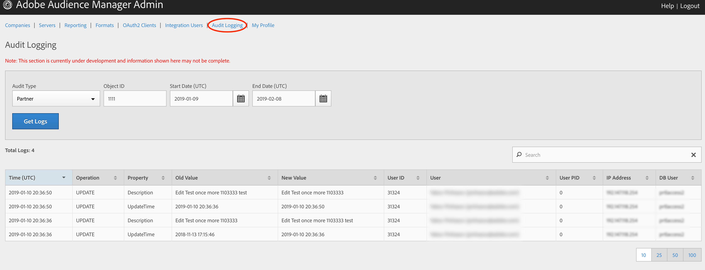

# Registro de auditoria {#audit-logging}

Use [!UICONTROL  Audit Logging] como primeiro lugar ao depurar problemas do cliente.

> [!NOTE]
>
>[!UICONTROL Audit Logging] estão em desenvolvimento e estão sujeitos a alterações. Registre quaisquer problemas que você encontrar em [!DNL JIRA] ([!DNL UI] equipe)

No **seletor** suspenso Tipo de auditoria, escolha entre:

* [!UICONTROL Partner]
* [!UICONTROL User]
* [!UICONTROL Group]
* [!UICONTROL Datasource Summary]
* [!UICONTROL General Datasource]
* [!UICONTROL Merge Rule Datasource]
* [!UICONTROL Data Feed]
* [!UICONTROL Data Feed Subscription]
* [!UICONTROL Trait Summary]
* [!UICONTROL Trait Rule]
* [!UICONTROL Segment Summary]
* [!UICONTROL Destination Summary]
* [!UICONTROL Server to Server Destination]
* [!UICONTROL Derived Signal]
* [!UICONTROL Model]
* [!UICONTROL Segment Test Group]

A ID **do objeto** é a ID do item que você está investigando. Consulte a tabela abaixo para a qual a ID corresponde à ID do objeto em cada caso:

| Tipo de auditoria | ID do objeto |
---------|----------|
| [!UICONTROL Partner] | ID do parceiro - PID |
| [!UICONTROL User] | ID de usuário |
| [!UICONTROL Group] | B3 |
| [!UICONTROL Datasource Summary] | ID da fonte de dados |
| [!UICONTROL General Datasource] | ID da fonte de dados |
| [!UICONTROL Merge Rule Datasource] | ID da fonte de dados |
| [!UICONTROL Data Feed] | ID do feed de dados |
| [!UICONTROL Data Feed Subscription] | ID do feed de dados |
| [!UICONTROL Trait Summary] | SID (característica) |
| [!UICONTROL Trait Rule] | SID (característica) |
| [!UICONTROL Segment Summary] |  |
| [!UICONTROL Destination Summary] |  |
| [!UICONTROL Server-to-Server Destination] | N/A |
| [!UICONTROL Derived Signal] | N/A |
| [!UICONTROL Model] | N/A |
| [!UICONTROL Segment Test Group] | N/A |

Use [!UICONTROL Start Date] ([!DNL UTC]) e [!UICONTROL End Date] ([!DNL UTC]) para restringir o intervalo de tempo dos logs.