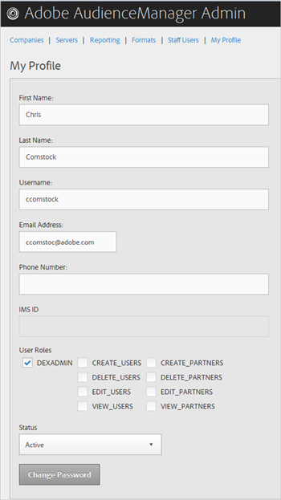
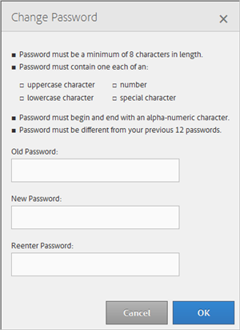

# Meu perfil {#my-profile}

Edite os detalhes do perfil da ferramenta de administração do Audience Manager ou altere a senha.

<!-- c_my_profile.xml -->

## Editar perfil {#edit-profile}

Visualize e edite seu perfil da ferramenta do administrador do Audience Manager, incluindo nome e sobrenome, nome de usuário, endereço de email, número de telefone, [!UICONTROL IMS ID], funções de usuário e status.

<!-- t_edit_profile.xml -->

1. Clique em **[!UICONTROL My Profile]**.

   

2. Preencha os campos:
   * **[!UICONTROL First Name]:** (Obrigatório) Especifique seu nome.
   * **[!UICONTROL Last Name]:** (Obrigatório) Especifique seu sobrenome.
   * **[!UICONTROL Username]:** (Obrigatório) Especifique seu primeiro nome de usuário.
   * **[!UICONTROL Email Address]:** (Obrigatório) Especifique seu endereço de email.
   * **[!UICONTROL Phone Number]:** Especifique seu número de telefone.
   * **[!UICONTROL IMS ID]:** Especifique a ID do serviço de mensagens da Internet.
   * **[!UICONTROL User Roles]:** Selecione as funções de usuário desejadas:
      * **[!UICONTROL DEXADMIN]:** Fornece acesso de administrador para executar tarefas na ferramenta Audience Manager Admin. Se você não selecionar essa opção, poderá escolher funções individuais. Essas funções permitem que os usuários executem tarefas usando [!DNL API] chamadas, mas não na Ferramenta de administração.
      * **[!UICONTROL CREATE_USERS]:** Permite que os usuários criem novos usuários usando um [!DNL API] chame.
      * **[!UICONTROL DELETE_USERS]:** Permite que os usuários excluam usuários existentes usando um [!DNL API] chame.
      * **[!UICONTROL EDIT_USERS]:** Permite que os usuários editem usuários existentes usando um [!DNL API] chame.
      * **[!UICONTROL VIEW_USERS]:** Permite que os usuários visualizem outros usuários em sua configuração de Audience Manager usando um [!DNL API] chame.
      * **[!UICONTROL CREATE_PARTNERS]:** Permite que os usuários criem parceiros de Audience Manager usando um [!DNL API] chame.
      * **[!UICONTROL DELETE_PARTNERS]:** Permite que os usuários excluam parceiros de Audience Manager usando um [!DNL API] chame.
      * **[!UICONTROL EDIT_PARTNERS]:** Permite que os usuários editem parceiros de Audience Manager usando um [!DNL API] chame.
      * **[!UICONTROL VIEW_PARNTERS]:** Permite que os usuários visualizem parceiros de Audience Manager usando um [!DNL API] chame.
   * **[!UICONTROL Status]:** Selecione o status desejado:
      * **[!UICONTROL Active]:** Especifica que este usuário está em um usuário Audience Manager ativo.
      * **[!UICONTROL Deactivated]:** Especifica que este usuário é um usuário desativado no Gerenciamento de público-alvo.
      * **[!UICONTROL Expired]:** Especifica que a conta deste usuário no Audience Manager expirou.
      * **[!UICONTROL Locked Out]:** Especifica que a conta deste usuário no Audience Manager está bloqueada.
3. Clique em **[!UICONTROL Submit]**.

## Alterar senha {#change-password}

Altere a senha da ferramenta Audience Manager Admin.

<!-- t_change_password.xml -->

1. Clique em **[!UICONTROL My Profile]**.
1. Clique em **[!UICONTROL Change Password]**.

   

   A senha do Audience Manager deve ser:

   * Pelo menos oito caracteres;
   * Ter pelo menos um caractere maiúsculo;
   * Conter pelo menos um caractere minúsculo;
   * Ter pelo menos um número;
   * Ter pelo menos um caráter especial;
   * Começar e terminar com um caractere alfanumérico;
   * Comece e termine com um caractere alfanumérico.

1. Especifique sua senha antiga.
1. Especifique a nova senha e confirme-a.
1. Clique em **[!UICONTROL OK]**.
