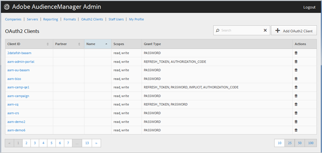

# Clientes oauth 2 {#oauth-clients}

Use [!UICONTROL OAuth2 Clients] a página para exibir uma lista [!UICONTROL OAuth2] de clientes na [!DNL Audience Manager] sua configuração. É possível editar ou excluir clientes existentes ou criar novos clientes, desde que você tenha as funções apropriadas de usuário atribuídas.

## Visão geral {#overview}

<!-- c_oauth.xml -->

>[!NOTE]
>
>Certifique-se de que o cliente lê a [documentação do oauth 2](https://docs.adobe.com/content/help/en/audience-manager/user-guide/api-and-sdk-code/rest-apis/aam-api-getting-started.html#oauth) no [! Guia do usuário do DNL Audience Manager.

[!DNL OAuth2] é um padrão aberto para a autorização fornecer acesso delegado aos [!DNL Audience Manager] recursos em nome de um proprietário de recursos.

É possível classificar cada coluna em ordem crescente ou decrescente clicando no cabeçalho da coluna desejada.

Use [!UICONTROL Search] a caixa ou os controles de paginação na parte inferior da lista para encontrar o cliente desejado.

## Criar ou editar um cliente oauth 2 {#create-edit-client}

<!-- t_create_edit_auth.xml -->

Use [!UICONTROL OAuth2 Clients] a página na ferramenta do Audience Manager [!UICONTROL Admin] para criar um [!UICONTROL Oauth2] novo cliente ou editar um cliente existente.

1. Para criar um [!UICONTROL OAuth2] novo cliente, clique **[!UICONTROL OAuth2 Clients]** em &gt; **[!UICONTROL Add OAuth2 Client]**. Para editar um [!UICONTROL OAuth2] cliente existente, clique no cliente desejado na **[!UICONTROL Client ID]** coluna.
1. Especifique o nome desejado para este [!UICONTROL OAuth2] cliente. Observe que este é um nome apenas para o registro.
1. Especifique o endereço de email [!UICONTROL OAuth2] do cliente. Há um limite de um endereço de email.
1. Na lista **[!UICONTROL Partner]** suspensa, selecione o parceiro desejado.
1. Na **[!UICONTROL Client ID]** caixa, especifique a ID desejada. Esse é o valor usado ao enviar [!DNL API] solicitações. O prefixo preenche automaticamente quando você começa a digitar depois de ter escolhido um [!UICONTROL Partner] da lista suspensa na etapa anterior. O formato correto é &lt; *`partner subdomain`*&gt; - &lt; *`Audience Manager username`*&gt;.
1. Marque ou desmarque a caixa **[!UICONTROL Restrict to Partner Users]** de seleção, conforme desejado. Se essa caixa de seleção for selecionada, o usuário deverá ser um [!DNL Audience Manager] usuário listado para o parceiro selecionado. Como prática recomendada, recomendamos que você selecione essa opção.
1. Na **[!UICONTROL Scope]** seção, marque ou desmarque as **[!UICONTROL Read]** caixas **[!UICONTROL Write]** de seleção, conforme desejado.
1. Na **[!UICONTROL Grant Type]** seção, selecione os meios desejados para a autorização. Recomendamos que você use as configurações padrão e [!UICONTROL Password][!UICONTROL Refresh-token] as opções.

   * **[!UICONTROL Implicit]**: Se você selecionar essa opção, a [!UICONTROL Redirect URI] caixa estará habilitada. O usuário recebe um token de acesso automático depois de ser autenticado e é enviado imediatamente para o redirecionamento [!DNL URI].
   * **[!UICONTROL Authorization Code]**: Se você selecionar essa opção, a [!UICONTROL Redirect URI] caixa estará habilitada. O usuário é retornado para o cliente depois de ser autenticado e é enviado para o redirecionamento [!DNL URI].
   * **[!UICONTROL Password]**: O usuário é autenticado com uma senha digitada pelo usuário em vez de uma tentativa de validação automática por meio de um servidor de autorização.
   * **[!UICONTROL Refresh_token]**: Usado para atualizar um token de acesso expirado por um período estendido.

1. Na **[!UICONTROL Redirect URI]** caixa, especifique o desejado [!DNL URI]. Essa opção só estará ativada se você selecionar os **[!UICONTROL Implicit]** tipos e **[!UICONTROL Authorization_code]** conceder tipos. **[!UICONTROL Redirect URI]** A caixa permite especificar um valor separado por vírgulas de [!DNL URI] valores aceitáveis. É o [!DNL URI] usuário de um cliente que é redirecionado para depois de aprovar o cliente para [!DNL API] acesso.
1. Especifique o tempo de expiração desejado (em segundos) para o acesso e a expiração do token de atualização.

   * **[!UICONTROL Access Token Expiration Time]**: O número de segundos que um token de acesso é válido após ser emitido. Pode ser nulo para usar o padrão da plataforma (12 horas). Também pode ser -1 para indicar que o token de acesso não expira.
   * **[!UICONTROL Refresh Token Expiration Time]**: O número de segundos que um token atualizado é válido após ser emitido. Pode ser nulo para usar o padrão da plataforma (30 dias).

1. Clique em **[!UICONTROL Save]**.

Para excluir um [!UICONTROL OAuth2] cliente, clique **[!UICONTROL OAuth2 Clients]** em, em seguida, clique  em na **[!UICONTROL Actions]** coluna do cliente desejado.

>[!MORE_ LIKE_ THIS]
>
>* [Requisitos de API e Recomendações](../admin-oauth2/aam-admin-api-requirements.md)

