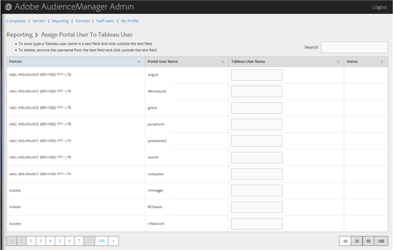

# Atribuir um usuário do portal a um usuário do Tableau {#assign-a-portal-user-to-tableau-user}

<!-- t_tabeau.xml -->

Use o [!UICONTROL Reporting] página para tornar um usuário do portal um [!DNL Tableau] usuário. Isso permite que os usuários visualizem [!DNL Tableau] relatórios no Audience Manager.

1. Clique em **[!UICONTROL Reporting]** > **[!UICONTROL Assign Portal User to Tableau User]**.

   

1. Para atribuir um usuário, na linha de parceiro desejada, digite um [!DNL Tableau] nome de usuário no campo de texto e clique fora do campo de texto.

Para excluir uma atribuição de usuário, na linha de parceiro desejada, remova o nome de usuário do campo de texto e clique fora do campo de texto.
