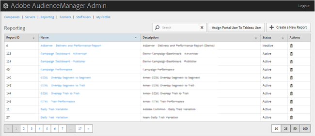

# Relatório {#reporting}

Gerencie relatórios de Audience Manager criando novos relatórios ou editando ou excluindo relatórios existentes. Você também pode atribuir um usuário do portal como um [!DNL Tableau] usuário.

<!-- c_reporting.xml -->

É possível classificar cada coluna em ordem crescente ou decrescente clicando no cabeçalho da coluna desejada.

Use a [!UICONTROL Search] caixa ou os controles de paginação na parte inferior da lista para localizar o relatório desejado.
