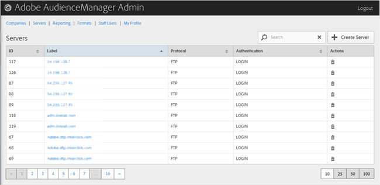

# Excluir um servidor {#delete-a-server}

Use a [!UICONTROL Servers] página na ferramenta Admin do Audience Manager para excluir um servidor existente.

<!-- t_delete_server.xml -->

>[!NOTE]
>
>Você deve ter a [!UICONTROL DEXADMIN] função para excluir servidores existentes.

1. Para excluir um servidor existente, clique em **[!UICONTROL Servers]**.

   

1. Clique  na **[!UICONTROL Actions]** coluna do servidor desejado.
1. Clique em **[!UICONTROL OK]para confirmar a exclusão.**
