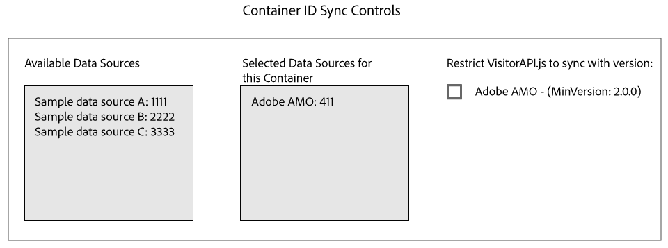

# Sincronização de ID com Media Optimizer {#id-syncing-with-media-optimizer}

Por padrão, todas as empresas sincronizam dados com [!DNL Adobe Media Optimizer] ([!DNL AMO]). No [!UICONTROL Admin UI], cada contêiner de empresa tem uma fonte de dados que gerencia esse processo. Essa fonte de dados é [!UICONTROL Adobe AMO] ([!UICONTROL ID] 411). Clique em uma linha de contêiner (abaixo da [!UICONTROL Containers] guia) para uma empresa selecionada desativar essa sincronização padrão ou adicionar e remover outras fontes de dados para o processo [!DNL AMO] de sincronização.

## Status da sincronização de ID {#id-sync-status}

A tabela a seguir descreve o status de sincronização de uma fonte de dados.

| Status | Descrição |
|------ | -------- |
| Desligado | Remova todas as fontes de dados do [!UICONTROL Selected Data Sources] contêiner para desativar sincronizações de ID com [!DNL AMO] |
| Ativado (independentemente da versão do serviço de ID) | Uma fonte de dados com [!DNL AMO] independentemente da versão do serviço de ID quando: <ul><li>A fonte de dados aparece na [!UICONTROL Selected Data Sources] lista.</li><li>A caixa [!DNL AMO]*de seleção não* está selecionada.</li></ul> |
| Ativado (independentemente da versão do serviço de ID) | Uma fonte de dados será sincronizada [!DNL AMO] com o serviço de ID versão 2.0 (ou superior) quando: <ul><li>A fonte de dados aparece na [!UICONTROL Selected Data Sources] lista.</li><li>A caixa [!DNL AMO]*de seleção está* selecionada.</li></ul> |

>[!MORE_ LIKE_ THIS]
>
>* [Gerenciar contêineres](../companies/admin-manage-containers.md#task_61DB5CEECC5049DD8D059C642AC3F967)

