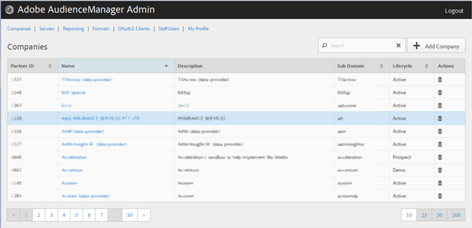

# Empresas {#companies}

Use [!UICONTROL Companies] a página para exibir uma lista de empresas na configuração do Audience Manager. É possível editar ou excluir empresas existentes ou criar novas empresas, desde que você tenha as funções apropriadas de usuário atribuídas.

É possível classificar cada coluna em ordem crescente ou decrescente clicando no cabeçalho da coluna desejada.

Use [!UICONTROL Search] a caixa ou os controles de paginação na parte inferior da lista para encontrar a empresa desejada.
