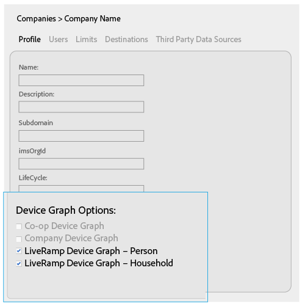
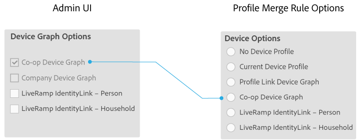
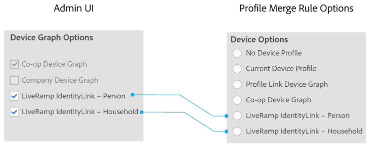

# Opções de gráfico de dispositivo para empresas {#device-graph-options-for-companies}

As empresas [!UICONTROL Device Graph Options] estão disponíveis para participar do [!DNL Adobe Experience Cloud Device Co-op]. Se um cliente também tiver uma relação contratual com um provedor de gráfico de dispositivo de terceiros integrado ao Audience Manager, esta seção mostrará opções para esse gráfico de dispositivo. Essas opções estão localizadas em [!UICONTROL Companies] &gt; nome da empresa &gt; [!UICONTROL Profile] &gt; [!UICONTROL Device Graph Options].

Esta ilustração usa nomes genéricos para as opções de gráficos de dispositivos de terceiros. Na produção, esses nomes vêm do provedor de gráficos de dispositivos e podem variar do que é mostrado aqui. Por exemplo, as [!DNL LiveRamp] opções normalmente (mas nem sempre):

* Comece com "[!DNL LiveRamp]"
* Contém um nome do meio que varia
* Terminar com "[!UICONTROL - Household]" ou "[!UICONTROL -Person]"

## Definição das opções do gráfico de dispositivos {#device-graph-options-defined}

As opções do gráfico de dispositivos que você seleciona aqui expõem ou ocultam as [!UICONTROL Device Options] opções disponíveis para um [!DNL Audience Manager] cliente quando ele cria um [!UICONTROL Profile Merge Rule].

### Gráfico de dispositivos cooperativos {#co-op-graph}

Os clientes que participam do Device Co-op [da](https://marketing.adobe.com/resources/help/en_US/mcdc/) Adobe Experience Cloud usam essas opções para criar um [!UICONTROL Profile Merge Rule] com dados determinísticos e probabilísticos. O [!DNL Corporate Provisioning Team] ativa e desativa essa opção por meio de uma [!DNL API] chamada de back-end. Não é possível marcar nem desmarcar essas caixas no [!DNL Admin UI]. Além disso, as opções **[!UICONTROL Co-op Device Graph]** e **[!UICONTROL Company Device Graph]** são mutuamente exclusivas. Os clientes podem nos pedir para ativar um ou o outro, mas não ambos. Quando marcado, isso expõe o **[!UICONTROL Co-op Device Graph]** controle nas [!UICONTROL Device Options] configurações de um [!UICONTROL Profile Merge Rule].

### Gráfico de dispositivos da empresa {#company-graph}

Essa opção é para [!DNL Analytics] os clientes que usam a [!UICONTROL People] métrica em seu conjunto de [!DNL Analytics] relatórios. O [!DNL Corporate Provisioning Team] ativa e desativa essa opção por meio de uma [!DNL API] chamada de back-end. Não é possível marcar nem desmarcar essas caixas no [!DNL Admin UI]. Além disso, as opções **[!UICONTROL Company Device Graph]** e **[!UICONTROL Co-op Device Graph]** são mutuamente exclusivas. Os clientes podem nos pedir para ativar um ou o outro, mas não ambos. Quando marcado:

* Este gráfico de dispositivos usa dados determinísticos que pertencem à empresa que você está configurando (sem dados probabilísticos).
* [!DNL Audience Manager] cria automaticamente um [!UICONTROL Data Source] nome de `*`parceiro`*-Company Device Graph-Person`. Na página de [!UICONTROL Data Source] detalhes, [!DNL Audience Manager] os clientes podem alterar o nome do parceiro, a descrição e aplicar os Controles [de exportação de](https://marketing.adobe.com/resources/help/en_US/aam/c_dec.html) dados a essa fonte de dados.
* [!DNL Audience Manager] os clientes *não* veem uma nova configuração na [!UICONTROL Device Options] seção para uma [!UICONTROL Profile Merge Rule].

### LiveRamp Device Graph (Pessoa ou Família) {#liveramp-device-graph}

Essas caixas de seleção são ativadas no [!DNL Admin UI] momento em que um parceiro cria um [!UICONTROL Data Source] e seleciona **[!UICONTROL Use as an Authenticated Profile]** e/ou **[!UICONTROL Use as a Device Graph]**. Os nomes dessas configurações são determinados pelo provedor de gráficos de dispositivo de terceiros (por exemplo, [!DNL LiveRamp], [!DNL TapAd]etc.). Quando marcada, isso significa que a empresa que você está configurando usará os dados fornecidos por esses gráficos de dispositivo.

>[!MORELIKETHIS]
>
>* [Definição das opções de regra de mesclagem de perfil](https://marketing.adobe.com/resources/help/en_US/aam/merge-rule-definitions.html)
>* [Configurações da fonte de dados e opções de menu](https://marketing.adobe.com/resources/help/en_US/aam/datasource-settings-definitions.html)

