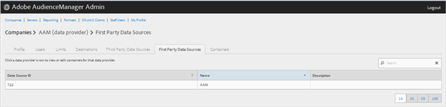
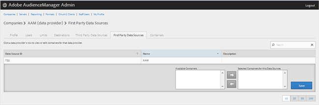

# Gerenciar provedores de dados próprios {#manage-first-party-data-providers}

Exibir ou editar containers e mapeamentos para provedores de dados primários.

<!-- t_first_party_providers.xml -->

1. Clique em **[!UICONTROL Companies]**, localize e clique na empresa desejada para exibir sua [!UICONTROL Profile] página. Use o [!UICONTROL Search] ou nos controles de paginação na parte inferior da lista para localizar a empresa desejada. Você pode classificar cada coluna em ordem crescente ou decrescente clicando no cabeçalho da coluna desejada.

1. Clique em **[!UICONTROL First Party Data Providers]** guia.

   

1. Clique na linha de um provedor de dados para exibir ou editar containers e mapeamentos para esse provedor de dados.

   

1. Mover contêineres do **[!UICONTROL Available Containers]** e **[!UICONTROL Selected Containers for This Data Provider]** listas selecionando os contêineres desejados e clicando nas setas para a direita ou esquerda, conforme necessário.
1. Clique em **[!UICONTROL Save]** se você tiver feito alterações.
