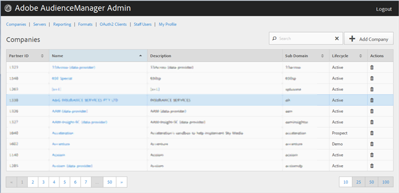

# Criar um perfil de empresa {#create-a-company-profile}

Use [!UICONTROL Companies] a página na ferramenta Administração do Audience Manager para criar uma nova empresa.

<!-- t_create_company.xml -->

>[!NOTE]
>
>Você deve ter **[!UICONTROL DEXADMIN]** a função para criar novas empresas.

1. Click **[!UICONTROL Companies]** &gt; **[!UICONTROL Add Company]**.
1. Preencha os campos:

   * **[!UICONTROL Name]**: (Obrigatório) Especifique o nome da empresa.
   * **[!UICONTROL Description]**: (Obrigatório) Forneça informações descritivas sobre a empresa, como setor ou seu nome completo.
   * **[!UICONTROL Subdomain]**: (Obrigatório) Especifique o subdomínio da empresa. O texto inserido é o que é mostrado como o subdomínio da chamada do evento. Isso não pode ser alterado. Deve ser uma string de [!DNL URL]caracteres -válidos.

      Por exemplo, se sua empresa foi nomeada [!DNL AcmeCorp], o subdomínio [!DNL acmecorp]seria.

      O Audience Manager usa o subdomínio para a [!UICONTROL Data Collection Server]([!UICONTROL DCS]). No exemplo anterior, se a sua empresa [!DNL URL] estiver [!UICONTROL DCS] completa [!DNL acmecorp.demdex.net].

   * **[!UICONTROL Lifecyle]**: Especifique o estágio desejado para a empresa:
      * **[!UICONTROL Active]**: Especifique se a empresa será um cliente do Audience Manager ativo. Uma [!UICONTROL Active] conta significa um cliente pago, não apenas para consultoria, mas para o SKU do Audience Manager.
      * **[!UICONTROL Demo]**: Especifique se a empresa será apenas para fins de demonstração. Os dados do relatório serão automaticamente enviados por fax.
      * **[!UICONTROL Prospect]**: Especifique se a empresa é um cliente potencial do Audience Manager, como uma empresa que está sendo criada gratuitamente [!DNL POC] ou uma configuração de conta para uma demonstração de vendas.
      * **[!UICONTROL Test]**: Especifique se a empresa será apenas para fins de teste interno.
   * **[!UICONTROL Account Types]**: Especifique o conjunto completo de tipos de conta para esta empresa. Nenhum tipo de conta é mutuamente exclusivo com qualquer outro tipo.
      * **[!UICONTROL Full AAM]**: Especifique se a empresa terá uma conta completa do Adobe Audience Manager e os usuários terão acesso de logon.
      * **[!UICONTROL MMP]**: Especifique que a empresa foi habilitada para usar os recursos [!UICONTROL Master Marketing Profile] ([!UICONTROL MMP]). Permite [!UICONTROL MMP] que os públicos-alvo sejam compartilhados na Experience Cloud usando um [!UICONTROL Experience Cloud ID] ([!DNL MCID]) que é atribuído a cada visitante e, em seguida, usado pelo Audience Manager. Se você selecionar este tipo de conta, a opção [!UICONTROL Experience Cloud ID Service] também será automaticamente selecionada.

         Para obter mais informações, consulte [Serviços de público-alvo - Perfil principal de marketing](https://marketing.adobe.com/resources/help/en_US/mcloud/audience_library.html).
   * **[!UICONTROL Data Source]**: Especifique se a empresa é um provedor de dados de terceiros no Audience Manager.
   * **[!UICONTROL Targeting Partner]**: Especifique que a empresa atua como uma plataforma de definição de metas para clientes do Audience Manager.
   * **[!UICONTROL Visitor ID Service]**: Especifique que a empresa foi habilitada para usar o [!UICONTROL Experience Cloud Visitor ID Service].

      Fornece [!UICONTROL Experience Cloud Visitor ID Service] uma ID de visitante universal nas soluções da Experience Cloud. For more information, see the [Experience Cloud Visitor ID Service user guide](https://marketing.adobe.com/resources/help/en_US/mcvid/mcvid-overview.html).

   * **[!UICONTROL Agency]**: Especifique se a empresa terá [!UICONTROL Agency] uma conta.

1. Clique em **[!UICONTROL Create]**. Continue com as instruções em [Editar um perfil da empresa](../companies/admin-manage-company-profiles.md#edit-company-profile).

   

## Editar um perfil da empresa {#edit-company-profile}

Edite o perfil de uma empresa, incluindo seu nome, descrição, subdomínio, ciclo de vida e muito mais.

<!-- t_edit_company_profile.xml -->

1. Clique **[!UICONTROL Companies]** em, em seguida localize e clique na empresa desejada para exibir sua [!UICONTROL Profile] página.

   Use [!UICONTROL Search] a caixa ou os controles de paginação na parte inferior da lista para encontrar a empresa desejada. É possível classificar cada coluna em ordem crescente ou decrescente clicando no cabeçalho da coluna desejada.

   

1. Edite os campos conforme necessário:

   * **[!UICONTROL Name]**: Edite o nome da empresa. Este é um campo obrigatório.
   * **[!UICONTROL Description]**: Edite a descrição da empresa. Este é um campo obrigatório.
   * **[!UICONTROL Subdomain]**: (Obrigatório) Especifique o subdomínio da empresa. O texto inserido é o que é mostrado como o subdomínio da chamada do evento. Isso não pode ser alterado. Deve ser uma string de [!DNL URL]caracteres -válidos.

      Por exemplo, se sua empresa foi nomeada [!DNL AcmeCorp], o subdomínio [!DNL acmecorp]seria.

      O Audience Manager usa o subdomínio para a [!UICONTROL Data Collection Server] ([!UICONTROL DCS]). No exemplo anterior, se a sua empresa [!DNL URL] estiver [!UICONTROL DCS] completa [!DNL acmecorp.demdex.net].

   * **[!UICONTROL imsOrgld]**: ([!UICONTROL Identity Management System Organization ID]) Essa ID permite conectar sua empresa com a Adobe Experience Cloud.
   * **[!UICONTROL Lifecyle]**: Especifique o estágio desejado para a empresa:
      * **[!UICONTROL Active]**: Especifique se a empresa será um cliente do Audience Manager ativo. Uma conta Ativa significa um cliente pago, não apenas para consultoria, mas para o SKU do Audience Manager.
      * **[!UICONTROL Demo]**: Especifique se a empresa será apenas para fins de demonstração. Os dados do relatório serão automaticamente enviados por fax.
      * **[!UICONTROL Prospect]**: Especifique se a empresa é um cliente potencial do Audience Manager, como uma empresa que está sendo criada gratuitamente [!DNL POC] ou uma configuração de conta para uma demonstração de vendas.
      * **[!UICONTROL Test]**: Especifique se a empresa será apenas para fins de teste interno.
   * **[!UICONTROL Account Types]**: Especifique o conjunto completo de tipos de conta para esta empresa. Nenhum tipo de conta é mutuamente exclusivo com qualquer outro tipo.
      * **[!UICONTROL Full AAM]**: Especifique se a empresa terá uma conta completa do Adobe Audience Manager e os usuários terão acesso de logon.
      * **[!UICONTROL MMP]**: Especifique que a empresa foi habilitada para usar os recursos Master Marketing Profile ([!UICONTROL MMP]).

         Se você selecionar este tipo de conta, **[!UICONTROL Visitor ID Service]** também será automaticamente selecionado.
Para obter mais informações, consulte [Serviços de público-alvo - Perfil principal de marketing](https://marketing.adobe.com/resources/help/en_US/mcloud/audience_library.html).
   * **[!UICONTROL Data Source]**: Especifique se a empresa é um provedor de dados de terceiros no Audience Manager.
   * **[!UICONTROL Targeting Partner]**: Especifique que a empresa atua como uma plataforma de definição de metas para clientes do Audience Manager.
   * **[!UICONTROL Visitor ID Service]**: Especifique que a empresa foi habilitada para usar o Serviço de ID de visitante da Experience Cloud.

      O serviço de ID de visitante da Experience Cloud fornece uma ID de visitante universal em todas as soluções da Experience Cloud. For more information, see the [Experience Cloud Visitor ID Service user guide](https://microsite.omniture.com/t2/help/en_US/mcvid/mcvid_service.html).

   * **[!UICONTROL Agency]**: Especifique se a empresa terá uma conta Agência.
   * **[!UICONTROL Features]**: Selecione as opções desejadas:
      * **[!UICONTROL Password Expiration]**: Define todas as senhas de usuário nesta empresa para expirar após 90 dias para aumentar a segurança do Audience Manager.
      * **[!UICONTROL Reporting]**: Ativa os relatórios do Audience Manager para esta empresa.
      * **[!UICONTROL Role Based Access Controls]**: Ativar controles de acesso com base em funções para esta empresa. Os controles de acesso baseados em funções permitem que você crie grupos de usuários com permissões de acesso diferentes. Os usuários individuais nesses grupos podem acessar somente recursos específicos no Audience Manager.

1. Clique em **[!UICONTROL Submit Updates]**.

## Excluir um perfil da empresa {#delete-company-profile}

Use [!UICONTROL Companies] a página na ferramenta do Audience Manager [!UICONTROL Admin] para excluir uma empresa existente.

<!-- t_delete_company.xml -->

>[!NOTE]
>
>Você deve ter [!UICONTROL DEXADMIN] a função para excluir as empresas existentes.

1. Para excluir uma empresa existente, clique **[!UICONTROL Companies]** em.

   

1. Clique  em na **[!UICONTROL Actions]** coluna da empresa desejada.
1. Clique em **[!UICONTROL OK]para confirmar a exclusão.**
