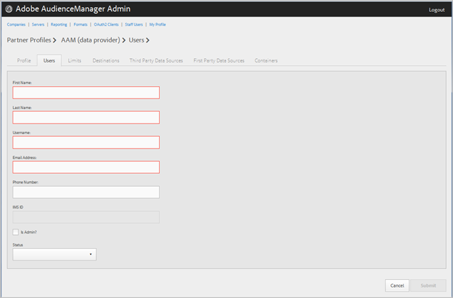

# Gerenciar usuários da empresa {#manage-company-users}

Crie novos usuários do Audience Manager ou edite e exclua usuários existentes.

<!-- t_manage_company_users.xml -->

1. Clique em **[!UICONTROL Companies]**, localize e clique na empresa desejada para exibir sua [!UICONTROL Profile] página.

   Use a [!UICONTROL Search] caixa ou os controles de paginação na parte inferior da lista para localizar a empresa desejada. É possível classificar cada coluna em ordem crescente ou decrescente clicando no cabeçalho da coluna desejada.
1. Click the **[!UICONTROL Users]** tab.
1. Para criar um novo usuário, clique em **[!UICONTROL Create a New User]**. Para editar um usuário existente, localize e clique na coluna do usuário desejado. **[!UICONTROL Username]**

   

1. Preencha os campos:

   * **[!UICONTROL First Name]**: (Obrigatório) Especifique o nome do usuário.
   * **[!UICONTROL Last Name]**: (Obrigatório) Especifique o sobrenome do usuário.
   * **[!UICONTROL Username]**: (Obrigatório) Especifique o nome de usuário do Audience Manager do usuário. Os nomes de usuário devem ser exclusivos.
   * **[!UICONTROL Email Address]**: (Obrigatório) Especifique o endereço de email do usuário.
   * **[!UICONTROL Phone Number]**: Especifique o número de telefone do usuário.
   * **[!UICONTROL IMS ID]**: O do usuário [!UICONTROL Identity Management System ID]. Essa ID permite que o usuário vincule as soluções da Adobe à Adobe Experience Cloud.
   * **[!UICONTROL Is Admin]**: Torne este usuário um usuário administrativo Audience Manager. Um administrador tem todas as funções de Audience Manager para este parceiro.
   * **[!UICONTROL Status]**: Ao criar um novo usuário, esse campo é exibido inicialmente **[!UICONTROL Pending]** até que o usuário faça logon e redefina a senha temporária. Se você estiver editando um usuário existente, poderá selecionar um dos seguintes status:
      * **[!UICONTROL Active]**: Especifica que este usuário é um usuário Audience Manager ativo.
      * **[!UICONTROL Deactivated]**: Especifica que este usuário é um usuário Audience Manager desativado.
      * **[!UICONTROL Expired]**: Especifica que este usuário é um usuário expirado.
      * **[!UICONTROL Locked Out]**: Especifica que este usuário é um usuário bloqueado.

1. Clique em **[!UICONTROL Submit]**.

## Excluir um usuário {#delete-user}

Para excluir um usuário:

1. Clique em **[!UICONTROL Companies]**, localize e clique na empresa desejada e, em seguida, clique na **[!UICONTROL Users]** guia.
1. Clique  na **[!UICONTROL Actions]** coluna do usuário desejado.
1. Clique em **[!UICONTROL OK]** para confirmar a exclusão.