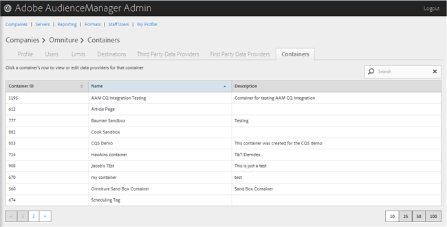
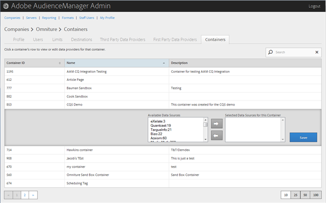

# Gerenciar contêineres {#manage-containers}

Exibir ou editar provedores de dados para contêineres.

<!-- t_containers.xml -->

>[!NOTE]
>
>Por padrão, as empresas são criadas com um contêiner. Você pode criar outros contêineres para uma empresa na interface do usuário, em **[!UICONTROL Manage Data > Tags]**.

1. Clique **[!UICONTROL Companies]** em, em seguida localize e clique na empresa desejada para exibir sua [!UICONTROL Profile] página.

   Use [!UICONTROL Search] a caixa ou os controles de paginação na parte inferior da lista para encontrar a empresa desejada. É possível classificar cada coluna em ordem crescente ou decrescente clicando no cabeçalho da coluna desejada.

1. Click the **[!UICONTROL Containers]** tab.

   

1. Clique na linha de um contêiner para exibir ou editar provedores de dados para esse contêiner.

   

1. Mova fontes de dados das **[!UICONTROL Available Data Sources]****[!UICONTROL Selected Data Sources for This Container]** listas selecionando as fontes de dados desejadas e, em seguida, clicando nas setas à direita ou à esquerda, conforme necessário.

   Você também pode executar essa tarefa a partir de [Providerspage de terceiros](../companies/admin-third-party-providers.md#task_E942DD674D794BA6B8EFD52FD866E689).

1. Clique **[!UICONTROL Save]** em se você fez alterações.

>[!MORE_ LIKE_ THIS]
>
>* [Sincronização de ID com Media Optimizer](../companies/admin-amo-sync.md#concept_2B5537233DAA4860B3503B344F937D83)

