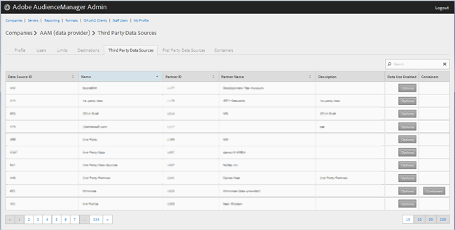
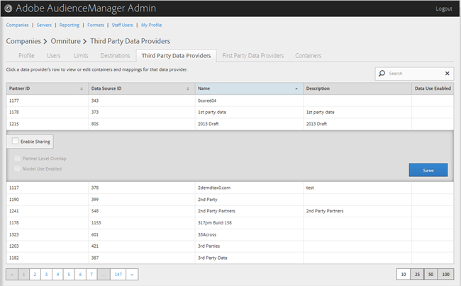

# Gerenciar provedores de dados de terceiros {#manage-third-party-data-providers}

Exibir ou editar contêineres e mapeamentos para provedores de dados de terceiros. Você também pode ativar o compartilhamento com diferentes provedores de dados.

1. Clique em **[!UICONTROL Companies]**, localize e clique na empresa desejada para exibir sua [!UICONTROL Profile] página.

   Use a [!UICONTROL Search] caixa ou os controles de paginação na parte inferior da lista para localizar a empresa desejada. É possível classificar cada coluna em ordem crescente ou decrescente clicando no cabeçalho da coluna desejada.
1. Click the **[!UICONTROL Third Party Data Providers]** tab.

   

1. Clique na linha de um provedor de dados para exibir ou editar contêineres e mapeamentos para esse provedor de dados.

   

1. Selecione **[!UICONTROL Enable Sharing]** para ativar as seguintes opções:

   * **Sobreposição de nível de parceiro:**
   * **** Uso do modelo ativado: Permite que essa empresa use esse provedor de dados ao criar modelos algorítmicos.
   Ao ativar o compartilhamento, você obtém acesso às características desse provedor de dados.

1. (Condicional) Se o contêiner estiver ativado para esse provedor, você pode selecionar contêineres para esse provedor de dados movendo os contêineres desejados da lista disponível para a lista selecionada.

   Também é possível executar essa tarefa na página [Contêineres](../companies/admin-manage-containers.md#task_61DB5CEECC5049DD8D059C642AC3F967) .
1. Clique **[!UICONTROL Save]** se tiver feito alterações.