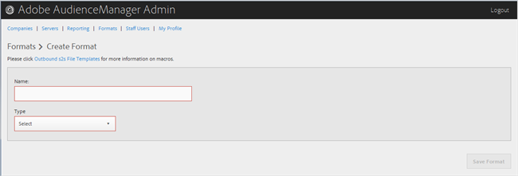

# Criar ou editar um formato {#create-or-edit-a-format}

Use a [!UICONTROL Formats] página na ferramenta Admin do Audience Manager para criar um novo formato ou editar um formato existente.

<!-- t_create_format.xml -->

>[!TIP]
>
>Ao selecionar um formato para seus dados externos, é melhor, se possível, reutilizar um formato existente. O uso de um formato já comprovado garante que seus dados de saída sejam gerados com êxito. Para ver exatamente como um formato existente é formatado, clique na [!UICONTROL Formats] opção na barra de menus e procure seu formato por nome ou por número de ID. Formatos malformados ou macros usados em formatos fornecem saída formatada incorretamente ou impedirão que as informações sejam totalmente geradas.

1. Para criar um novo formato, clique em **[!UICONTROL Formats]** > **[!UICONTROL Add Format]**. Para editar um formato existente, clique no formato desejado na **[!UICONTROL Name]** coluna.

   

1. Preencha os campos:
   * **Nome:** (Obrigatório) Forneça um nome descritivo para o formato.
   * **Tipo:** (Obrigatório) Selecione o formato desejado:
      * **[!UICONTROL File]**: Envia dados via [!DNL FTP] arquivos.
      * **[!UICONTROL HTTP]**: Encerra dados em um [!DNL JSON] invólucro.

1. (Condicional) Se você escolher **[!UICONTROL File]**, preencha os campos:

   >[!NOTE]
   >
   >Para obter uma lista de macros disponíveis, consulte Macros [de formato de](../formats/file-formats.md#concept_A867101505074418A58DE325949E5089) arquivo e Macros [de formato](../formats/web-formats.md#reference_C392124A5F3F42E49F8AADDBA601ADFE)HTTP.

   * **[!UICONTROL File Name]:**Especifique o nome do arquivo para o arquivo de transferência de dados.
   * **Cabeçalho:** Especifique o texto que aparece na primeira linha do arquivo de transferência de dados.
   * **[!UICONTROL Data Row]:**Especifique o texto que aparece em cada linha delimitada do arquivo.
   * **[!UICONTROL Maximum File Size (In MB)]:**Especifique o tamanho máximo de arquivo para arquivos de transferência de dados. Os arquivos compactados devem ter menos de 100 MB. Não há limite para o tamanho de arquivo descompactado.
   * **[!UICONTROL Compression]:**Selecione o tipo de compactação desejado: gz ou zip para seus arquivos de dados. Para o delivery[!UICONTROL AWS S3], você deve usar arquivos .gz ou descompactados.
   * **[!UICONTROL .info Receipt]:**Especifica que um arquivo de controle de transferência ([!DNL .info]) é gerado. O[!DNL .info]arquivo fornece informações de metadados sobre transferências de arquivos para que os parceiros possam verificar se o Audience Manager processou transferências de arquivos corretamente. Para obter mais informações, consulte Arquivos de controle de[transferência para transferências](https://marketing.adobe.com/resources/help/en_US/aam/c_s2s_add_transfer_control_files.html)de arquivos de log.
   * **[!UICONTROL MD5 Checksum Receipt]:**Especifica que um recebimento de[!DNL MD5]soma de verificação é gerado. O recibo de[!DNL MD5]soma de verificação para que os parceiros possam verificar se o Audience Manager lidou com a transferência completa corretamente.

1. (Condicional) Se você escolher **[!UICONTROL HTTP]**, preencha os campos:

   * **[!UICONTROL Method]:**Escolha o[!DNL API]método que deseja usar para o processo de transferência:
      * **[!UICONTROL POST]:**Se você selecionar[!DNL POST], selecione o tipo de conteúdo ([!DNL XML]ou[!DNL JSON]) e especifique o corpo da solicitação.
      * **[!UICONTROL GET]:**Se você selecionar[!DNL GET], especifique os parâmetros do query.

1. Clique **[!UICONTROL Create]** se estiver criando um novo formato ou clique **[!UICONTROL Save Updates]** se estiver editando um formato existente.

## Excluir um formato {#delete-format}

1. Clique em **[!UICONTROL Formats]**.
2. Clique  na **[!UICONTROL Actions]** coluna do formato desejado.
3. Clique em **[!UICONTROL OK]** para confirmar a exclusão.
