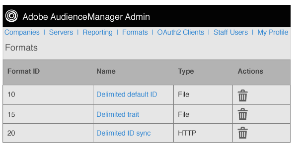

# Visão geral dos formatos {#formats-overview}

Um formato é um modelo salvo (ou arquivo) que usa macros para organizar o conteúdo dos dados enviados para um destino. Os tipos de formato incluem formatos [!DNL HTTP] e formatos de arquivo. [!DNL HTTP] os formatos enviam dados em um  [!DNL JSON] objeto com um  [!DNL POST] ou  [!DNL GET] método. Os formatos de arquivo enviam dados em um arquivo por [!DNL FTP]. As macros usadas por cada formato permitem que você defina nomes de arquivos, defina cabeçalhos de arquivos e organize o conteúdo de um arquivo de dados. No Admin [!DNL UI], é possível criar, salvar e reutilizar formatos ao configurar destinos para clientes.

